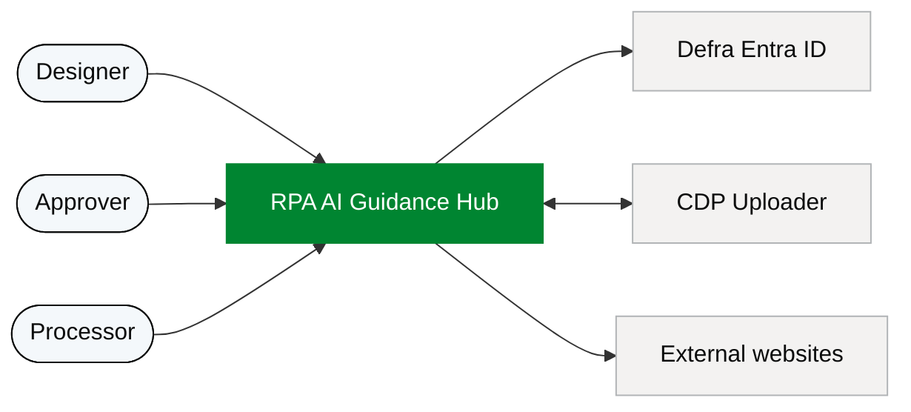
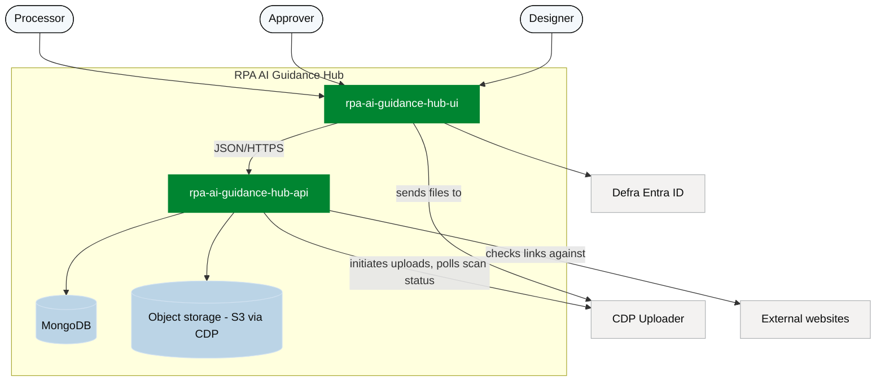
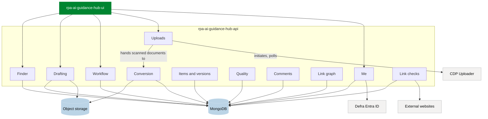
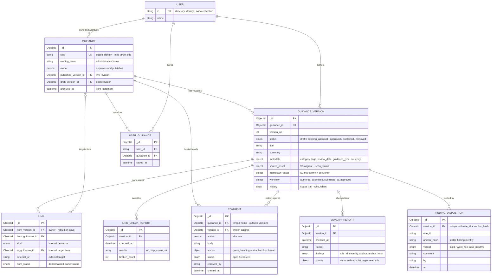

# Architecture

The RPA AI Guidance Hub across four views: system context, containers, the
API's components, and the data model. GitHub renders the diagrams below
natively; the mermaid source in this file is the source of truth.

The hub is two CDP services — `rpa-ai-guidance-hub-ui` and
`rpa-ai-guidance-hub-api` — with all backend functionality in the API
service. Content bytes live in object storage; MongoDB holds identity,
revisions, the link graph, review state and per-user state.

## System context (C1)

Three kinds of user, one system, three platform/external dependencies.

- **Designer** authors, uploads and reviews guidance.
- **Approver** is the named approver for a guide: approves and publishes it.
- **Processor** finds and reads published guidance to process applications.
- **Defra Entra ID** provides sign-in; approver and author identities come
  from here.
- **CDP Uploader** is the platform's file transfer and virus scanning.
- **External websites** (GOV.UK and others) are link targets the hub
  checks periodically.

## Containers (C2)

- **rpa-ai-guidance-hub-ui** — the interface: search and filters, the
  TipTap editor with quality checks, comments and version history beside
  it, drafts and approvals.
- **rpa-ai-guidance-hub-api** — the REST API. Workflow transitions are
  explicit actions (submit / approve / reject / publish / remove) so each
  invariant lives in one handler. Document conversion and link checking
  run inside this service too — there are no separate workers.

## API components (C3)

The component groups inside `rpa-ai-guidance-hub-api`, which are also the
API surface: one group per resource, plus the two internal jobs.

| Component | Responsibility |
| --- | --- |
| Finder | `GET /guidance` — search and facets over published versions |
| Items and versions | Item, version history, item-level changes (owner, archive) |
| Drafting | Open draft, save content and metadata, restore a version. A save bundles its side effects: rebuild links, run quality checks, re-anchor comments |
| Workflow | submit / approve / reject / publish / remove — enforces owner-not-author and one-open-version |
| Uploads | Initiate with CDP Uploader, poll status, create a guide from the converted document |
| Quality | Check reports joined with durable verdict dispositions |
| Comments | Anchored review threads with resolved state |
| Link graph | Inbound "what links here", removal impact, link-picker suggest, external check results |
| Me | Person-keyed views: my drafts, my approvals, my saved guides |
| Conversion | Word to markdown (mammoth) after a clean scan |
| Link checks | Scheduled sweep of external links; writes reports |

## Data model

Crow's foot on the many side. `USER` is a directory identity from Entra,
not a stored collection.

### Design notes

- **Derived vs durable.** `LINK` and `QUALITY_REPORT` are rebuildable
  caches — regenerated from markdown on every version save, never edited
  by hand. `COMMENT` and `FINDING_DISPOSITION` are human state: a save
  re-anchors comments (the anchor flips to orphaned when the passage is
  gone) and never deletes either. Dispositions join to findings on
  `(version_id, rule_id, anchor_hash)`, so a re-run never resurrects a
  settled finding.
- **Person-keyed views.** *My approvals* is
  `status: pending_approval` + `workflow.submitted_to.id`, denormalised
  from `GUIDANCE.owner` at submit time. *My drafts* is the latest version
  per item where `workflow.authored_by.id` is me. *My saved guides* is
  `USER_GUIDANCE` by `user_id`, newest first.
- **Invariants (enforced in code).** At most one published and one open
  version per item. The owner is never the author of a version they
  approve. Changing an item's owner re-points `submitted_to` on its open
  submissions in the same write. Internal links resolve
  `to_guidance_id` → that item's published version at render time.
  Archiving a guide cleans or tombstones its `USER_GUIDANCE` rows.
