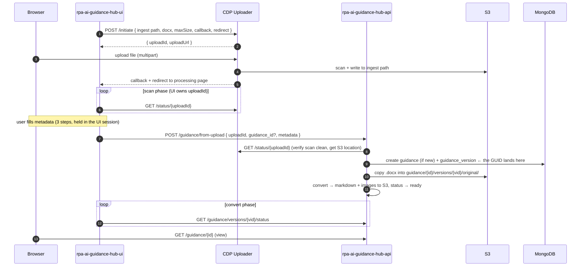
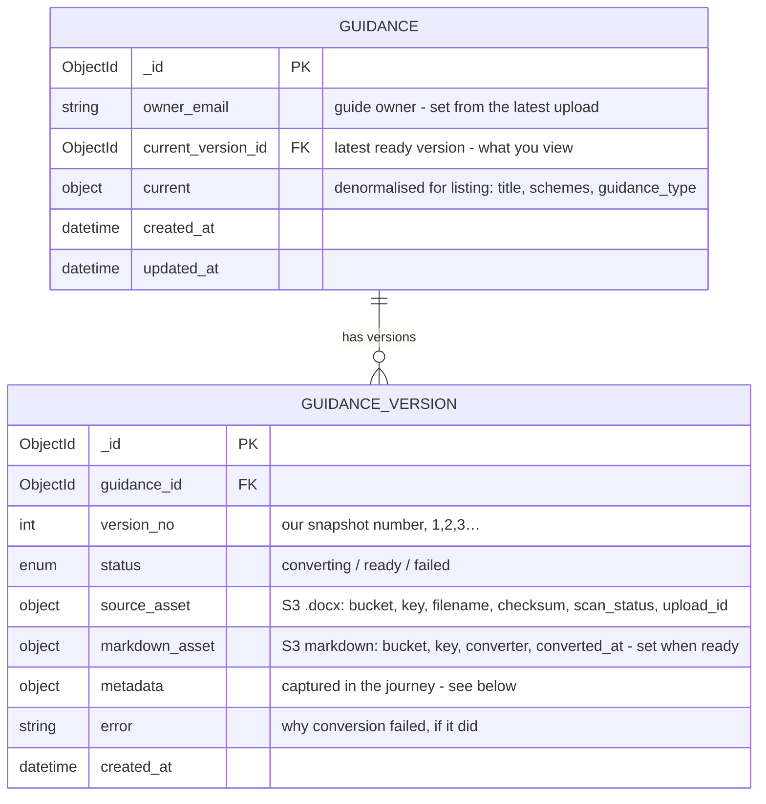

# Initial journey — upload, convert, view, version

The minimal slice: upload a Word document, convert it to markdown, view the
result, and keep a version history. No editorial workflow, comments, quality
checks, link graph, or per-user state yet — those are later tiers.

Two services: `rpa-ai-guidance-hub-ui` (the frontend) and
`rpa-ai-guidance-hub-api` (all backend functionality). Content bytes live in
S3 via CDP; MongoDB holds identity, versions and metadata.

## Who owns the upload

The **frontend owns the CDP Uploader interaction end to end** — it calls
`/initiate`, renders the upload form, polls the uploader for scan progress,
and handles the redirect. The **API is called once, at Convert**, with a
reference to the already-scanned file; it verifies the scan itself, then owns
everything from there (mint identity, adopt the file, convert, serve).



### When the identity is created

The `guidance` and `guidance_version` `_id`s are minted **at step 8
(`POST /guidance/from-upload`)** — not before. During upload, scan and
metadata capture the only identifier is the CDP Uploader `uploadId`, held in
the UI session. Because the guidance-scoped S3 path needs the ids, the
uploader writes to a neutral **ingest path** and the API **copies** the file
into `guidance/{id}/versions/{vid}/original/` once it mints the ids.
Abandoning before Convert therefore leaves **no Mongo record** — only an
ingested file that an S3 lifecycle rule reclaims.

## Schema

The item / version split is the whole of versioning: the item is stable
identity + ownership + a pointer to what you view; each version is an
immutable snapshot of one upload.



### `guidance_version.metadata`

| Field | Type | Notes |
| --- | --- | --- |
| `title` | string | Read from the document, editable, required |
| `doc_version` | string | The document's own version (e.g. "2.3"), read-only |
| `doc_last_modified` | date | Read from the document, read-only |
| `schemes` | [enum] | **Multi-select** — a guide can cover several schemes |
| `not_scheme_specific` | bool | Exclusive with `schemes` (generic / cross-scheme guidance) |
| `guidance_type` | enum | Chosen from a predefined list |
| `goal` | string | What the guidance aims to achieve, required |
| `audience` | [enum] | e.g. processor, team-leader |
| `requirements` | string | What users need to do or understand |
| `systems` | [enum] | e.g. Siti Agri, CRM |

Distinctions to hold: `doc_version` (the author's number, from the file) is
**not** `version_no` (our monotonic per-upload snapshot number). `owner_email`
is stored on the **item**, not the version — ownership is a guide-level
concern.

### S3 layout

```
guidance/{guidance_id}/versions/{version_id}/original/{filename}.docx
guidance/{guidance_id}/versions/{version_id}/markdown/content.md
guidance/{guidance_id}/versions/{version_id}/images/{name}.png
```

Images extracted during conversion land under the version's `images/` prefix;
the markdown references them by bare name.

### Indexes

```
db.guidance_version.createIndex({ guidance_id: 1, version_no: -1 })  // history + latest
db.guidance.createIndex({ updated_at: -1 })                         // listing
```

### Reference vocabularies

Scheme, guidance-type, audience and system lists are **config the API
serves**, not per-guide data — so the UI's pick-lists (and their acronyms)
come from one place and the taxonomy can change without a UI deploy.

```
scheme         { code, name, acronym }   // e.g. { "sfi", "Sustainable Farming Incentive", "SFI" }
guidance_type  { code, name }
audience, system … likewise
```

The scheme list, the guidance-type options, and whether "Cross Compliance"
is a scheme in its own right are **open content decisions** that live here,
not in the schema.

## Conversion state machine

Scan and rejection happen frontend-side before the API exists, so a version's
backend lifecycle is short:

```
from-upload ──> converting ──ok──> ready
                    │
                  error
                    ▼
                  failed
```

A file whose scan is not clean is rejected at `from-upload`; no version is
created. On `ready` the API advances `guidance.current_version_id` and
refreshes `guidance.current`.

## API

### Ingest — one call, at Convert

| Method · path | Purpose |
| --- | --- |
| `POST /guidance/from-upload` | Body `{ uploadId, guidance_id? (null = new guide, set = new version), metadata }`. The API calls CDP Uploader `GET /status/{uploadId}` **itself** to confirm the scan is clean and get the authoritative S3 location — it never trusts the client's claim — then mints the item (if new) + version, copies the `.docx` into the guide's S3 path, and starts conversion. Returns `{ guidance_id, version_id }`, status `converting`. |
| `GET /guidance/versions/{version_id}/status` | Poll conversion (`converting` / `ready` / `failed`). Drives the processing screen. |

The CDP Uploader `/initiate`, the upload form, scan-status polling and the
redirect are **frontend-owned** and are not API endpoints.

### View

| Method · path | Purpose |
| --- | --- |
| `GET /guidance` | List / browse — from `guidance.current` (title, schemes, guidance_type) + `updated_at`. |
| `GET /guidance/{id}` | The guide: `current` metadata + the current version's markdown (inline) with image references. |
| `GET /guidance/versions/{version_id}/images/{name}` | Serve an extracted image (presigned S3 redirect). |

### Version history

| Method · path | Purpose |
| --- | --- |
| `GET /guidance/{id}/versions` | History — each `{ version_no, doc_version, status, created_at }`. |
| `GET /guidance/{id}/versions/{version_no}` | View a specific older version's metadata + markdown. |

### Reference

| Method · path | Purpose |
| --- | --- |
| `GET /guidance/reference/schemes` | Scheme codes, names and acronyms — the UI's multi-select source. |
| `GET /guidance/reference/guidance-types` | The predefined guidance-type list. |

## The security seam

Letting the frontend own initiation creates exactly one rule the backend must
honour: **`from-upload` re-verifies the scan against CDP Uploader and never
accepts the client's assertion that a file is clean.** The `uploadId` and the
uploader's `scan_status` are recorded on `source_asset` as the audit trail of
what was verified and adopted.

## Out of scope / open decisions

- **Out of this tier:** editorial workflow (draft/pending/approved/published/
  removed), owner-as-approver, comments, quality reports, link graph,
  per-user state (saved guides), in-app editing.
- **Content decisions (reference vocab, not schema):** the definitive scheme
  list and Cross Compliance's status, the guidance-type options, the audience
  and system lists.
- **Business decisions:** owner semantics on a leaver / role change, and how
  `owner_email` is exposed once guidance is published.
- **Optional:** if metadata should persist server-side between wizard steps
  rather than in the UI session, add `PATCH /guidance/versions/{id}/metadata`
  — for this journey a single submit at Convert is enough.
