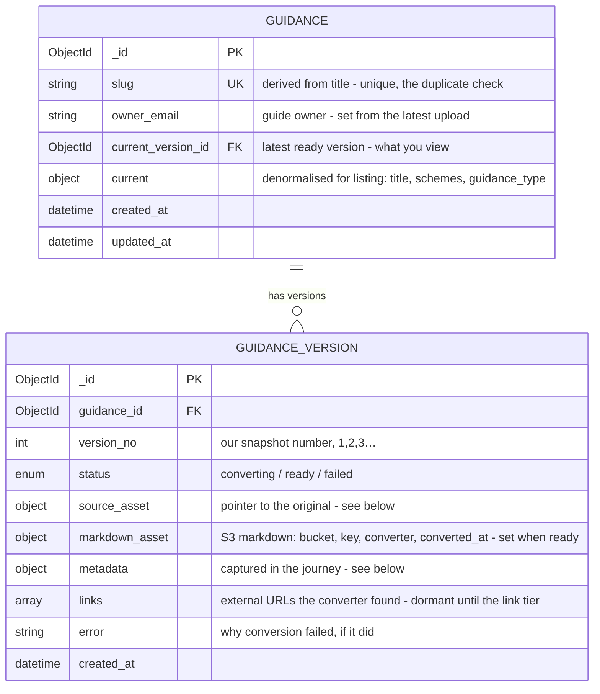

# Initial journey — upload, convert, view, version

The minimal slice: upload a Word document, convert it to markdown, view the
result, and keep a version history. No editorial workflow, comments, quality
checks, link graph, or per-user state yet — those are later tiers.

Two services: `rpa-ai-guidance-hub-ui` (the frontend) and
`rpa-ai-guidance-hub-api` (all backend functionality). Content bytes live in
S3 via CDP; MongoDB holds identity, versions and metadata.

## Who owns the upload

The **frontend owns the CDP Uploader interaction end to end** — it calls
`/initiate`, renders the upload form, polls the uploader for scan progress,
and handles the redirect. The **API is called once, at Convert**, with a
reference to the already-scanned file; it verifies the scan itself, then owns
everything from there (mint identity, adopt the file, convert, serve).

```mermaid
sequenceDiagram
  autonumber
  participant B as Browser
  participant UI as rpa-ai-guidance-hub-ui
  participant CU as CDP Uploader
  participant API as rpa-ai-guidance-hub-api
  participant S3 as S3
  participant DB as MongoDB

  UI->>CU: POST /initiate { originals/{upload_ref}/, docx, maxSize, callback, redirect }
  CU-->>UI: { uploadId, uploadUrl }
  B->>CU: upload file (multipart)
  CU->>S3: scan + write to originals/{upload_ref}/ (originals bucket)
  CU-->>UI: callback + redirect to processing page
  loop scan phase (UI owns uploadId)
    UI->>CU: GET /status/{uploadId}
  end
  Note over B,UI: user fills metadata (3 steps, held in the UI session)
  UI->>API: POST /guidance/from-upload { uploadId, guidance_id?, metadata }
  API->>CU: GET /status/{uploadId}  (verify scan clean, get S3 location)
  API->>DB: create guidance (if new) + guidance_version  ← the GUID lands here
  API->>S3: tag original with guidance_id (no move); write markdown + images to content bucket
  API->>API: convert → status → ready
  loop convert phase
    UI->>API: GET /guidance/versions/{vid}/status
  end
  B->>API: GET /guidance/{id}  (view)
```

### When the identity is created

The `guidance` and `guidance_version` `_id`s are minted **at step 8
(`POST /guidance/from-upload`)** — not before. During upload, scan and
metadata capture the only identifier is the CDP Uploader `uploadId`, held in
the UI session. Because the guidance-scoped S3 path needs the ids, the
uploader writes the original to `originals/{upload_ref}/…` in the originals
bucket, and the API records a **pointer** to it (never a copy) when it mints
the ids, tagging the object with the new `guidance_id`. Abandoning before
Convert therefore leaves **no Mongo record** — only an untagged original that
an S3 lifecycle rule reclaims.

## Schema

The item / version split is the whole of versioning: the item is stable
identity + ownership + a pointer to what you view; each version is an
immutable snapshot of one upload.



`source_asset` is a **pointer to the original in its own bucket** — never a
copy — keyed by the upload reference, because the original is written before
`guidance_id` exists (see S3, below):

```
source_asset = { bucket, key: "originals/{upload_ref}/{filename}.docx",
                 upload_ref, checksum, scan_status }
```

### `guidance_version.metadata`

| Field | Type | Notes |
| --- | --- | --- |
| `title` | string | Read from the document, editable, required |
| `doc_version` | string | The document's own version (e.g. "2.3"), read-only |
| `doc_last_modified` | date | Read from the document, read-only |
| `schemes` | [enum] | **Multi-select** — a guide can cover several schemes |
| `not_scheme_specific` | bool | Exclusive with `schemes` (generic / cross-scheme guidance) |
| `guidance_type` | enum | Chosen from a predefined list |
| `goal` | string | What the guidance aims to achieve, required |
| `audience` | [enum] | e.g. processor, team-leader |
| `requirements` | string | What users need to do or understand |
| `systems` | [enum] | e.g. Siti Agri, CRM |

Distinctions to hold: `doc_version` (the author's number, from the file) is
**not** `version_no` (our monotonic per-upload snapshot number). `owner_email`
is stored on the **item**, not the version — ownership is a guide-level
concern.

### S3 layout — two buckets

Originals and derived content **cannot share a key scheme**: the original is
uploaded before `guidance_id` exists, so it is keyed by the **upload
reference** (which exists at upload time); the derived content is written by
the backend once the ids are minted. That id-timing is the reason they are
separate buckets — plus their lifecycles differ (originals are cold and
rarely re-read; markdown is hot and served).

**Originals bucket** — the `.docx`, keyed by upload reference, write-once:
```
originals/{upload_ref}/{filename}.docx
```
Author/system access only, never served to readers. Lifecycle: transition to
IA/Glacier; longer retention (it is the re-derive source of truth).

**Content bucket** — the derived markdown and images, keyed by the guide/version:
```
guidance/{guidance_id}/versions/{version_id}/markdown/content.md
guidance/{guidance_id}/versions/{version_id}/images/{name}.png
```
Hot, served to viewers, regenerable from the original.

(CDP Uploader's quarantine bucket is a third, platform-owned, not ours.)

The **upload reference is the join** between the pre-DB upload and the
post-DB guide: the UI holds it in the session, `POST /guidance` receives it,
and `source_asset` records it. The original is never moved or copied.

**Associating an original with its guide** (guidance_id can't be in the key):
at `POST /guidance` the backend adds an S3 object **tag** `guidance_id={id}`
to the original — tags attach without moving the object. `source_asset` in
Mongo is the primary index; deletion of a guide cascades through it. A
lifecycle rule expires **untagged** originals (abandoned uploads) after a
short window, while tagged/adopted originals are retained.

### Indexes

```
db.guidance.createIndex({ slug: 1 }, { unique: true })              // identity + duplicate check
db.guidance_version.createIndex({ guidance_id: 1, version_no: -1 }) // history + latest
db.guidance.createIndex({ updated_at: -1 })                         // listing
```

### Reference vocabularies

Scheme, guidance-type, audience and system lists are **config the API
serves**, not per-guide data — so the UI's pick-lists (and their acronyms)
come from one place and the taxonomy can change without a UI deploy.

```
scheme         { code, name, acronym }   // e.g. { "sfi", "Sustainable Farming Incentive", "SFI" }
guidance_type  { code, name }
audience, system … likewise
```

The scheme list, the guidance-type options, and whether "Cross Compliance"
is a scheme in its own right are **open content decisions** that live here,
not in the schema.

## Conversion state machine

Scan and rejection happen frontend-side before the API exists, so a version's
backend lifecycle is short:

```
from-upload ──> converting ──ok──> ready
                    │
                  error
                    ▼
                  failed
```

A file whose scan is not clean is rejected at `from-upload`; no version is
created. On `ready` the API advances `guidance.current_version_id` and
refreshes `guidance.current`.

## Duplicate uploads

"Duplicate" is three cases, handled differently:

1. **Same guide (title/slug already exists)** — the real duplicate, and
   usually an intended re-upload. The slug is derived from the title, so it
   is checked **as soon as the title is known** (the metadata step, before
   conversion), not only at submit. On a collision the user is offered:
   **Update the existing guide** (open a new version), **use a different
   title**, or **cancel** — never a silent second item. Slugs are unique
   (`{ slug: 1 }, unique`), so `POST /guidance` also rejects a colliding slug
   server-side as a backstop ("this is an update, not a new item").
2. **Identical file (same checksum)** — an accidental repeat. `checksum` is
   recorded on `source_asset`; if the same bytes were adopted before, the UI
   shows a soft "you've already uploaded this document as …" nudge with
   *view / new version / continue*. Advisory, not a block.
3. **Double-submit of the same upload (same `upload_ref`)** — `POST /guidance`
   is **idempotent on `upload_ref`**: a repeat returns the existing guide, not
   a second one.

Enforcing unique slugs is deliberate: two live guides with the same title
would undermine find-and-filter, so a duplicate becomes a decision the user
resolves (update or rename) rather than a mess to clean up. Resolving as
"update existing" is creating a version of someone's guide, so it respects
ownership.

## Links

In this journey **links are content, not structure** — there is no `LINK`
collection and no graph.

- **External URLs** pass through as inline markdown, stored in `content.md`,
  rendered, viewed and versioned with the document.
- **Intra-document cross-references** work: the converter resolves Word
  bookmarks to the section numbers it derives (`](#bookmark)` → `](#3.1)`).
- **Cross-guide references** stay as whatever the document held (an old URL) —
  resolving them to internal guides needs the link graph, which is deferred.
- **Images** are the one link we extract — into the content bucket's
  `images/` prefix, referenced by bare name.

The one link concern that **is** in scope, because this journey renders the
markdown, is **safety**: link destinations are emitted unescaped, so
conversion/render applies a **scheme allow-list** (`http`, `https`, `mailto`,
`#`) to neutralise `javascript:` / `data:` targets.

`guidance_version.links` (the external URLs the converter found) is captured
as a **dormant list** — it does nothing in this journey, and only seeds the
later link-checking tier.

Deferred to the link-graph tier: "what links here", removal-impact warnings,
external link-checking / broken-link reports, the link picker, and cross-guide
resolution.

## API

### Ingest — one call, at Convert

| Method · path | Purpose |
| --- | --- |
| `POST /guidance/from-upload` | Body `{ uploadId, guidance_id? (null = new guide, set = new version), metadata }`. The API calls CDP Uploader `GET /status/{uploadId}` **itself** to confirm the scan is clean and get the authoritative S3 location — it never trusts the client's claim — then mints the item (if new) + version, records the `source_asset` pointer and tags the original with `guidance_id`, and starts conversion. Idempotent on `upload_ref`. Returns `{ guidance_id, version_id }`, status `converting`. On a colliding slug it returns a duplicate response the UI turns into "update or rename". |
| `GET /guidance/versions/{version_id}/status` | Poll conversion (`converting` / `ready` / `failed`). Drives the processing screen. |

The CDP Uploader `/initiate`, the upload form, scan-status polling and the
redirect are **frontend-owned** and are not API endpoints.

### View

| Method · path | Purpose |
| --- | --- |
| `GET /guidance` | List / browse — from `guidance.current` (title, schemes, guidance_type) + `updated_at`. |
| `GET /guidance/{id}` | The guide: `current` metadata + the current version's markdown (inline) with image references. |
| `GET /guidance/versions/{version_id}/images/{name}` | Serve an extracted image (presigned S3 redirect). |

### Version history

| Method · path | Purpose |
| --- | --- |
| `GET /guidance/{id}/versions` | History — each `{ version_no, doc_version, status, created_at }`. |
| `GET /guidance/{id}/versions/{version_no}` | View a specific older version's metadata + markdown. |

### Reference

| Method · path | Purpose |
| --- | --- |
| `GET /guidance/reference/schemes` | Scheme codes, names and acronyms — the UI's multi-select source. |
| `GET /guidance/reference/guidance-types` | The predefined guidance-type list. |

## The security seam

Letting the frontend own initiation creates exactly one rule the backend must
honour: **`from-upload` re-verifies the scan against CDP Uploader and never
accepts the client's assertion that a file is clean.** The `uploadId` and the
uploader's `scan_status` are recorded on `source_asset` as the audit trail of
what was verified and adopted.

## Out of scope / open decisions

- **Out of this tier:** editorial workflow (draft/pending/approved/published/
  removed), owner-as-approver, comments, quality reports, link graph,
  per-user state (saved guides), in-app editing.
- **Content decisions (reference vocab, not schema):** the definitive scheme
  list and Cross Compliance's status, the guidance-type options, the audience
  and system lists.
- **Business decisions:** owner semantics on a leaver / role change, and how
  `owner_email` is exposed once guidance is published.
- **Optional:** if metadata should persist server-side between wizard steps
  rather than in the UI session, add `PATCH /guidance/versions/{id}/metadata`
  — for this journey a single submit at Convert is enough.
